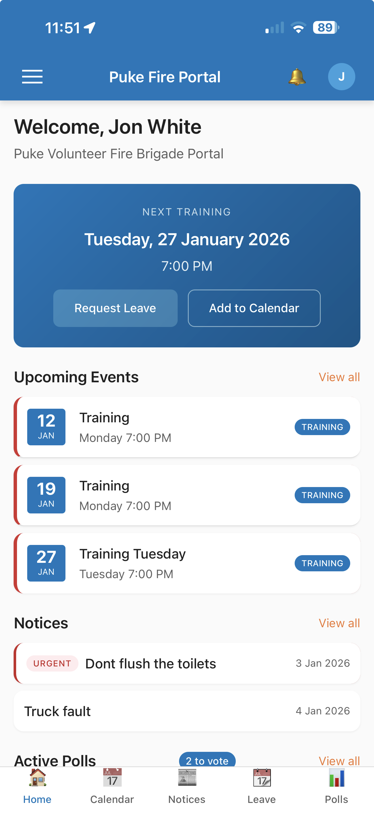

# Puke Fire Portal

A mobile-first Progressive Web App (PWA) for the Puke Volunteer Fire Brigade, providing calendar management, notice board, leave requests, and integration with the existing attendance system.

## Features

- **Calendar** - View upcoming training nights, events, and callouts with day/week/month views
- **Leave Requests** - Request leave for up to 3 upcoming trainings with officer approval workflow
- **Notices** - Brigade announcements with support for urgent, sticky, and timed notices
- **Polls** - Create and vote on brigade polls
- **Push Notifications** - Real-time alerts for leave approvals, urgent notices, and reminders
- **Offline Support** - Full PWA with service worker caching for offline access
- **Accessibility** - Colour blind mode for users with colour vision deficiency

## Technology Stack

| Component | Technology |
|-----------|------------|
| Backend | PHP 8.x (strict types) |
| Database | SQLite3 |
| Frontend | Vanilla JavaScript (ES6+) |
| Styling | CSS3 with CSS Variables |
| PWA | Service Worker + IndexedDB |
| Real-time | Server-Sent Events (SSE) |

## User Roles

- **Super Admin** - System-wide brigade management
- **Admin** - Brigade-level management, invite users, manage events/notices
- **Officer** - Approve leave requests from firefighters
- **Firefighter** - View calendar, request leave, view notices

## Installation

1. Clone the repository
2. Copy `portal/config/config.example.php` to `portal/config/config.php` and configure
3. Ensure `portal/data/` directory is writable
4. Point web server to `portal/public/`

## Integration

Integrates with the [dlb attendance system](https://github.com/jtbnz/dlb) for:
- Pre-populating training musters
- Syncing leave approvals
- Attendance tracking

## License

Private - Puke Volunteer Fire Brigade
